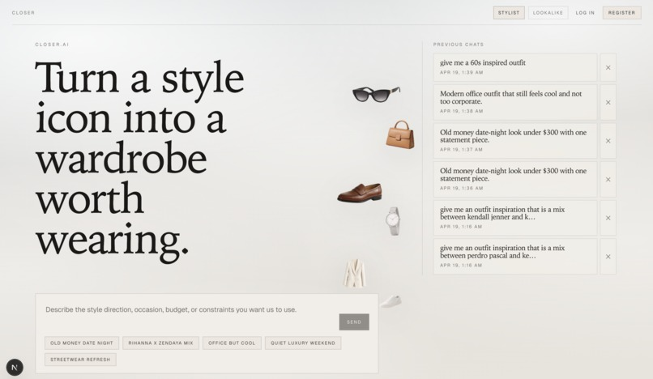

# Closer

Closer is a style assistant that turns a reference (a celebrity, a vibe, or a styling direction) into shoppable product suggestions.

The goal is straightforward: help someone move from "I like this style" to "here are concrete pieces I can actually buy," including budget-friendly follow-ups when requested.

## Product Purpose

Closer is built around one practical workflow:

1. A user asks for a look (for example, "style inspired by Hailey Bieber").
2. The app returns a curated set of products in a consistent shopping UI.
3. The user can refine the result ("show me cheaper alternatives") without losing context.

The product focuses on keeping this loop fast and understandable rather than trying to be a generic chatbot.

## Screenshot

Add your product screenshot here.

```md

```

## How It Works (High Level)

Closer has three main parts:

- `frontend/` (Next.js + TypeScript): user interface, session flow, timeline/recommendation rendering
- `backend/` (Express + TypeScript): prompt routing, curated profile logic, response shaping, auth-protected APIs
- `scraper/` (Python): product scraping support and price/image/url extraction utilities

At runtime, the frontend calls backend endpoints under `/api/*`. The backend decides whether to serve:

- curated celebrity outfit data (fast, controlled output), or
- generated/scraped data for more open-ended prompts.

## Key Technical Ideas

### 1) Prompt-aware follow-up behavior

The backend treats follow-up prompts as contextual refinements, not fresh searches. This enables flows like:

- initial request -> hero picks
- follow-up budget request -> cheaper alternatives for the same style direction

This is handled in the style resolution layer (`celebrityStyleService`) and surfaced through summary + product variants.

### 2) Stable product card contract

Frontend mapping (`frontend/src/lib/api.ts`) converts backend outfit variants into consistent card models:

- title, store, price/currency
- product URL
- image URL
- optional reason metadata

This keeps rendering predictable even when data quality varies between sources.

### 3) UI consistency between first result and follow-ups

The recommendation experience is rendered as an ordered timeline of blocks (user prompt, assistant explanation, product grid), so refinement turns stay readable and visually consistent with the initial result.

### 4) Practical image handling

Product imagery uses a component-based approach to minimize common ecommerce issues (cropping vs empty bars) while preserving readable cards across mixed image aspect ratios.

## Repository Structure

```text
.
├── backend/      # API, orchestration, curated profile services
├── frontend/     # Next.js app and recommendation UI
├── scraper/      # scraping helpers and extraction logic
└── verify_backend.sh
```

## Running Locally

### Backend

```bash
cd backend
npm install
npm run dev
```

### Frontend

```bash
cd frontend
npm install
npm run dev
```

By default, the frontend proxies API calls to `http://127.0.0.1:3001`.

## Notes for Contributors

- Curated celebrity data lives under `backend/src/data/hard/`.
- If a curated entry has partial metadata, the UI should degrade gracefully instead of inventing misleading copy.
- Keep follow-up behavior deterministic: user refinement should feel like continuation, not reset.

## License

No license file is currently defined in this repository.